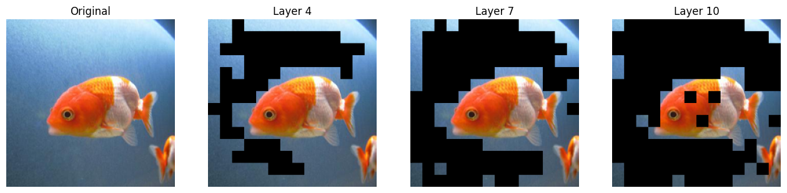
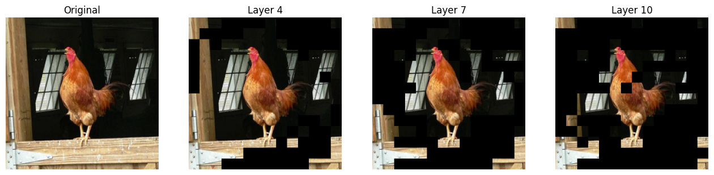

# Lab 6 - Transformer Pruning Report
  
1. **請說明 get_real_idx 實作部分是怎麼做的** 10%
    1. 	prev_global_idx 代表前一個 pruning 層已經轉換完成、對應到原始輸入的 token index。<br>curr_local_idx 為目前層的 pruning 結果，其索引是相對於前一層輸出的 token 序列。

    ```python
    prev_global_idx = real_idxs[-1] 
    curr_local_idx = idxs[i] 
    ```
    2. 限制 curr_local_idx 的最大值，確保他不超出 prev_global_idx 的索引範圍，避免後續索引操作發生越界的錯誤。
    ```python
    limit = prev_global_idx.size(1) - 1
    curr_local_idx = curr_local_idx.clamp(max=limit)
    ```
    3. 利用 torch.gather 根據 curr_local_idx，從 prev_global_idx 中取出對應的元素。
    ```python
    new_global = torch.gather(prev_global_idx, 1, curr_local_idx)
    ```
    4. 把new_global加入 real_idxs，作為目前層已完成轉換的 global index。
    ```python
    real_idxs.append(new_global)
    idxs[i] = new_global
    ```


2. **實際在哪些層做了 pruning ?** 

    從 `EViT(keep_rate=(1, 1, 1, 0.7) + (1, 1, 0.7) + (1, 1, 0.7) + (1, 1))` 來看 keep_rate=1表示不進行pruning，keep_rate<1代表會進行pruning。在index3,6,9的地方keep_rate =0.7，所以實際有做pruning的是layer4、layer7、layer9，
    
    
3. **如果沒有 get_real_idx 可視化結果會長怎樣，為什麼 ?** 

    如果沒有用get_real_idx的話，可視化結果會對不到原始影像的位置，因為pruning之後每一層輸出的idxs都是相對於前一層剩下token的local index，不是相對於原始輸入影像的index，如果直接拿這些local index去可視化，會被誤當成原始token位置，導致標示區域錯誤。
    
    
4. **分析視覺化的圖，這些變化代表著什麼 ?** 

    從下面兩張圖來看：
    * layer4 只進行第一次pruning，所以模型還保留大部分和物體相關的區域，同時開始移除明顯的背景
    * layer7 經過第二次pruning，背景token近一步被刪除，保留下來的token更集中在主要物體（魚跟雞）的輪廓上。
    * layer 10 最後一次pruning後，主要集中在物體最核心的部位像是雞的頭跟魚的眼睛，幾乎所有背景都變成黑色了。
    
    隨著layer加深，token pruning逐步將背景和次要區域移除，使模型的注意力從整體畫面收斂到關鍵語意位置。
    
    
    