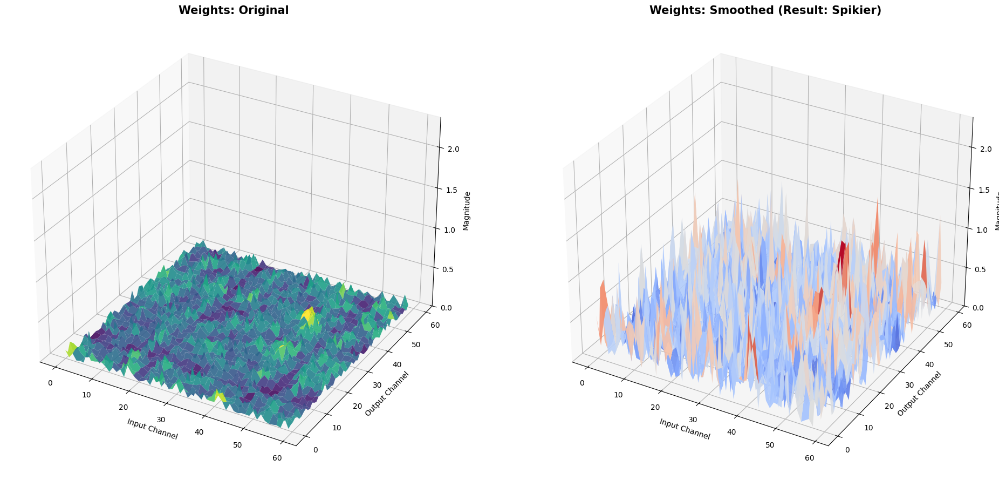

### 1. What's the difference between SmoothQuant and the method in Lab3?
* Lab3是 Post-Training Quantization(PTQ)跟Quantization-Aware Training(QAT)，SmoothQuant跟PTQ有點像，但他是訓練後，不需額外微調的PTQ，本質上就是training free的PTQ方法，對 activation outlier特別嚴重的LLM來說，SmoothQuant會更有效。
* SmoothQuant和PTQ最大的差異就在於他把outlier從activation搬到weight。

    PTQ直接對現有權重/ activation做統計，然後選scale/zero-point後量化。SmoothQuant先對每層做數學等價的per channel rescaling，把activation的outlier搬到weight，再套用一般的PTQ方法。
### 2. When applying SmoothQuant, where do activation values get divided by the smooth factor? 
在這個作業中的Block7 的 smooth_ln_fcs function中，透過修改ln(LayerNorm/Embedding)的參數完成的。
原本ln輸出的activation 是$ X_{old} $，經過smooth_ln_fcs後，透過調整ln.weight，讓他輸出的變成$ X_{new} $ = $ X_{old} / s $ 。再配合將fc.weight 乘上s，達成 $ XW = (X/s)(W * s) $的等價交換。
### 3.How is the smooth factor being calculated? 
用每個 input channel的activation 最大值和同一個 channel 的 weight 最大值，再搭配超參數 $\alpha$算出來的per-channel scale。
公式： $$ s_j = \frac {max(|X_j|)^\alpha} {max(|W_j|)^{1-\alpha}} $$
$max(|X_j|)$ 是從Block5蒐集到的activation統計資料，$max(|W_j|)$是對應Linear layer的每個channel的最大值weight。
### 4.What's the difference between ViT-S and CNN models when doing quantization? 
在量化時，CNN的卷積結構和分布較穩定，所以在8-bit下通常很好量化;Vit-S的Transformer結構對低bit更敏感，各層和各head的量化敏感差異度大。
* CNN :CNN做量化時，model多是規律的Conv+BN+ReLu堆疊，每一層結構和行為相似，權重和activation分布相對平滑，outlier較少。用標準的8-bit量化配置就能在PTQ或簡單的QAT下維持接近FP32的準度。
* Vit-S :ViT-S採用Transformer架構，不同層和不同head量化敏感度差異很大，所以需要更精細或客製化的量化方法像是專為Vit設計的PTQ4ViT、FQ-ViT。
### 5.What's your observation on the visualization of weight and activation values distribution
1. 從Weight的圖來看，原始的weight表面相對平坦，smooth過後的變的更起伏、尖尖的地方變得更多，這樣說明某些channel的全中被放大。這也對應了smoothQuant的機制，為了讓activation可以除以smooth factor，被縮小的部分會乘回對應channel的權重上，所以activation變平，weight變尖。
2. 從Activation的圖來看，原始的圖有多個很高的尖峰也就是outlier，經過smoothQuant後，大部分的channel值分布變的平滑且集中，尖峰大幅減少，最大值從6.76降到1.25。

